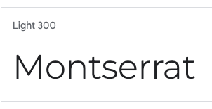

# DownwardDog Yoga Studio

This website is designed to bring together all yoga fans who are also dog owners, creating a safe place for them to practise yoga together and the opportunity for a vibrant community. 
The main focus is to be straight forward enough to save time for the user, yet to be engaging and motivating at the same time.

The user can interact with the website in various ways such as viewing relevant and uselful information on the articles page. The users, if they are registered and logged in, then can comment on the articles and also can express their opinion with a like. They can later also unlike the article, in case they changed their mind. 
The users can also see a selection of yoga classes, then also a selection of available dates and times for the relevant classes to choose from through the Yoga page. If they are logged in, they will be able to book, register their interest. After admin approval, the user is able to follow up their bookings on the My Bookings page, and also to delete the bookings that they are not able to attend anymore.  

This full-stack framework project was built using Django framework, Python, HTML, Bootstrap and CSS. Furthermore, the webiste stores all vital information and data in an external database, Cloudinary.

[Link to the live project](https://downwarddog.herokuapp.com/)

# Contents

- [User Experience (UX)](https://github.com/Lilla-Kavecsanszki/downwarddog#user-experience-ux)
  - [Ideal client](https://github.com/Lilla-Kavecsanszki/downwarddog#ideal-client)
  - [User stories & Epics](https://github.com/Lilla-Kavecsanszki/downwarddog#user-stories-and-epics)
- [Planning](https://github.com/Lilla-Kavecsanszki/downwarddog#planning)
- [Design](https://github.com/Lilla-Kavecsanszki/downwarddog#design)
  - [Wireframes](https://github.com/Lilla-Kavecsanszki/downwarddog#wireframes)
  - [Entity Relationship Diagrams](https://github.com/Lilla-Kavecsanszki/downwarddog#entity-relationshi-diagrams)
  - [Theme](https://github.com/Lilla-Kavecsanszki/downwarddog#theme)
- [Languages Used](https://github.com/Lilla-Kavecsanszki/downwarddog#languages-used)
- [Frameworks, Libraries, Programs & Technologies Used](https://github.com/Lilla-Kavecsanszki/downwarddog#frameworks-libraries-programs--technologies-used)
- [Features](https://github.com/Lilla-Kavecsanszki/downwarddog#features)
- [Deployment](https://github.com/Lilla-Kavecsanszki/downwarddog#deployment)
- [Testing](https://github.com/Lilla-Kavecsanszki/downwarddog#testing)
  - [Manual Testing](https://github.com/Lilla-Kavecsanszki/downwarddog#manual-testing)
  - [User Stories Testing](https://github.com/Lilla-Kavecsanszki/downwarddog#user-stories-testing)
  - [Further Testing](https://github.com/Lilla-Kavecsanszki/downwarddog#further-testing)
  - [Bugs](https://github.com/Lilla-Kavecsanszki/downwarddog#bugs)
- [Credits](https://github.com/Lilla-Kavecsanszki/downwarddog#credits)
  - [Content](https://github.com/Lilla-Kavecsanszki/downwarddog#content)
  - [Acknowledgments and Code](https://github.com/Lilla-Kavecsanszki/downwarddog#acknowledgments-and-code)
  - [Disclaimer](https://github.com/Lilla-Kavecsanszki/downwarddog#disclaimer)

# User Experience (UX)

### Ideal client

The ideal client for this business is:

-	English speaking
-	Practices yoga
-	A dog owner
-	Individuals, or couples or friends

Visitors of this website search for:

- A knowledgeable website that is easy to use
- That helps the user gain information about the topic of yoga, and practicing yoga with dogs
- That is reliable and accurate
- That encourage the visitors to create a communnity, through being able to communicate, comment and like articles
- That allows them to bring their dog to the yoga sessions
- That offers the visitors different choices on yoga classes to chose from
- That offers the visitors different dates and times when each classes are available
- That offers flexibility and so the user can delete a booked class in case they are no longer available

This website is the best way to help them achieve these goals because:

- The menu makes the access of different activities very easy to reach
- The content on the website is carefully curated and updated to ensure that the visitors receive reliable information
- The website offers interactive features as commenting, liking articles, encouraging the visitors to engage with the 
  contect and to create a community 
- The website offers dog-friendly yoga sessions, creating a unique yet inclusive experience for its visitors who would like to
  bring along their furry friends
- The website provides a wide range of yoga classes to chose from, allowing its visitors to choose based on their current 
  needs
- The website also displays multiple availabilities of each yoga class, allowing the visitors to choose the most convenient 
  one for their free time 
- The website offers flexibility in booking as it allows its visitors to delete a booked class, in case they are no 
  longer available, providing a hassle-free experience

This website:

- Is easy to navigate by the menu and buttons, offers an inclusive and engaging platform
- Gives the customers options and access to useful and learnable information.
- Gives the customers the information they need without overloading them or distracting them from their original ideas or
  wishes.
- Gives the customers the opportunity to connect with like-minded individuals
- Gives the the customers the opportunity to seamlessly manage their yoga sessions with their dogs

[Back to top](https://github.com/Lilla-Kavecsanszki/downwarddog#contents)

### User stories and Epics

##### Introduction and Navigation Epic

- #1  As a user, I can read the homepage so that I can get more information about the studio, the team, the approach to dogs 
      and yoga in general.
- #2  As a user, I can click on the navbar so that I go to the specific page I am interested in.

##### Account Management Epic

- #3  As a user, I can register to the website so that I have a higher level of permission and access.
- #4  As a user/admin, I can log in to the website so that I have the ability to book a class and/or comment on an article, 
      or like/unlike it.
- #5  As a user, I can see whether I logged in or registered so that I know that it was successful.
- #6  As a user, I can log out from the website so that I can protect my privacy and information.

##### Articles, Comments & Likes Epic

- #7  As a user, I can click on the article so that I can read the entire text about the topic and learn.
- #8  As a user, if I am logged in, I can like or unlike the articles so that I have the opportunity to show my interest 
      and appreciation.
- #9  As a user, if I am logged in, I can comment on the articles so that I can leave my feedback and/or thoughts 
      regarding the article.

##### Booking Epic

- #10 As a user, I can read more information about each classes so that I can choose which one suits me the best to book. 
- #11 As a user, if I am logged in, I can create a booking so that I can book and join a class.
- #12 As a user, I can choose the date of my future class so that I can book it on the date that suits my schedule.
- #13 As admin, I can authorize or disapprove booking enquiries so that I can assure that the classes are not overbooked.
- #14 As a user, I can edit my booking so that I can change the date.
- #15 As a user, if I am logged in, I can cancel my spot, my booking, so that I can give my space back to others and I can 
    join the class when I am available.

##### Management Epic

- #16 As an admin, I can authorize or disapprove comments so that I can assure that a respectful language is used at all times.
- #17 As an admin I can create, read, update and delete articles so that I can manage the content.
- #18 As an admin I can see each booking; the day and class combination, to understand how many clients has enquired/ booked 
    it so that I can analyse popularity and busy/ weak days.

##### Contact Epic

- #20 As a user, I can fill out a contact form so that I can communicate with the management, give my feedback, leave a review to the teachers and the studio

##### Future ambition - Planned for the next sprint

- #21 create a share button to be able to share the articles
- #22 after successfully creating a booking, for the user to receive a confirmation text or email and/or reminder before the class also
- #23 users to be able to add the booking information to their calendar

[Back to top](https://github.com/Lilla-Kavecsanszki/downwarddog#contents)

# Planning

Persona Profile - by using Code Institutes template - purpose of the website

- <a href="">

Agile Methodology 
Kanban board and Issues

# Design

### Wireframes

### Entity Relationship Diagrams

### Theme

[Colour Palette](https://colorkit.co/palette/ffff-f2eae3-c36d4e-322925/)

Fonts

# Languages Used

Python was used to complete this project.

[Back to top](https://github.com/Lilla-Kavecsanszki/downwarddog#contents)

# Frameworks, Libraries, Programs & Technologies Used

- [Lucid](https://lucid.app/documents#/documents?folder_id=recent) was used to create the ER Diagrams
- Github was used as the repository for the projects code after being pushed from Git
- Git was used for version control by the Gitpod terminal to commit to Git and Push to GitHub; to create and edit all
  original code
- [Google Fonts](https://fonts.google.com/) used for the Montserrat and Poiret One fonts
- [Font Awesome](https://fontawesome.com/) was used to add icons for aesthetic and UX purposes
- [Fonticon](https://gauger.io/fonticon/) was used to create the favicon
- [Bootstrap](https://getbootstrap.com/) was used to build a responsive website quicker
- Microsoft Word was used to create the wireframes during the design process.
- [Django](https://www.djangoproject.com/) was used as the framework of the application
- [Gunicorn](https://gunicorn.org/) was used as the Web Server to run Django on Heroku
- Django allauth used for account registration and authentication
- Django crispy forms used for form rendering
- Summernote used to to enable "WYSIWYG" (What You See Is What You Get) editing functionality to provide an intuitive and user-friendly interface
- [Cloudinary](https://cloudinary.com/) used to store the images and data used by the website
- [Heroku] was used to deploy the application and provides an enviroment in which the code can execute

[Back to top](https://github.com/Lilla-Kavecsanszki/downwarddog#contents)

# Features

#### Home - The Menu

The menu is displayed when the application starts to keep the interface simple to use and uncluttered. The menu features five options, functionalities for the user to choose from; 1) Print Product List, 2) Add New Product, 3) Delete Product, 4) Get the Order List and 5) Exit.

The user is prompted to choose one of the menu options by entering the option number. In the event of an invalid input, an error message will be displayed and the main menu will be displayed again.

The menu will continue to be displayed repeatedly until the user inputs a valid response and after the completion of each options (1-4). The application will be terminated only when the user selects option 5 from the menu.

#### Option 1 - Print Product List

If the user selects option 1 from the menu they are shown the list of the products that are currently on the stocks sheet in the Google Spreadsheet.

This is data taken from the Google Spreadsheet, all information listed under each other from its first column.

Products added or deleted while using the application will be reflected on the list when the 'Print Product List' option is subsequently run.

#### Option 2 - Add New Product

The user can add a new product by choosing option 2 from the menu. The application displays a message on screen listing the input requirements and also an example input string of values for better understanding.

[Back to top](https://github.com/Lilla-Kavecsanszki/downwarddog#contents)

# Deployment

**How to Clone**

Steps
 

1. Go to the <https://github.com/Lilla-Kavecsanszki/order-easy> repository
2. Click the Code button to the left of the green Gitpod button, then choose Local.
3. Click on headings for HTTPS, SSH, and Github CLI to find their individual URL links. Choose the HTTPs one.
4. Open your own terminal in your editor and change the current working directory to the location of where you want the
   cloned directory to be.
5. In the terminal type git clone, and then paste the URL you copied from the repository page.
6. Press enter to complete.

 

**How to create and configure the Google spreadsheet and APIs**

Steps
 

1. Log in (or create) to your Google account
2. Create a Google Spreadsheet (order_spreadsheet) on Google Drive. Mine has 1 page; 'stocks'.
3. In row 1 of the stocks sheet, create the headings: Products, Unit, Price, Par level, Current Stock Holding, How much to
   order
4. Then go ahead and fill out the sheet as needed. For the initial sample data used in this project click [here](https://github.com/Lilla-Kavecsanszki/order-easy#content---data-model)
5. Set up APIs on the [Google Cloud Platform](https://console.cloud.google.com/welcome?project=ordereasy-378810)
6. Create a new project, so click on the “Select a project” button and then select “new project”. and
7. Give it a unique name, then by clicking on “Select Project” again, go to dashboard
8. Setup Google Drive credentials
9. From the side menu (hamburger menu on the top) select "APIs and Services" and then "Library"
10. Search for Google Drive API
11. Select Google Drive API and click on the 'enable' button, which will take you to the API overview page.
12. Click the “Create credentials” button, then there is a form the fill out.
13. From the "Which API are you using?" dropdown menu, choose Google Drive API
14. For the "What data will you be accessing?" question, select Application Data
15. For the "Are you planning to use this API with Compute Engine, Kubernetes Engine, App Engine, or Cloud Functions?"     question, select No, I'm not using them
16. Click Next
17. Enter a Service Account name, then click Create
18. In the Role Dropdown box choose Basic > Editor then press Continue
19. You got taken to the next page, where those options can be left blank, click Done
20. On the next page, click on the Service Account that has been created
21. On the next page, click on the Keys tab
22. Click on the Add Key dropdown and select Create New Key
23. Select JSON and then click Create, which will trigger your credentials file to be downloaded  
    into our computer files
24. You also need to enable your Google Sheets API. So go back to the library again, and search for “google sheets”.  
25. Select the Google Sheets API, then click “enable” (there's no need for more credentials here)
Now you have your APIs enabled, and have your credentials file downloaded.  
26. Add your credentials file that you downloaded in step 23; so locate the json file wherever it is within your computer
    files and simply drag and drop it into your Gitpod workspace.
27. Rename it to "creds.json" to make it easier to use
28. Open up the json file and find the client_email value here, copy this email address generated for your credentials.
    Copy it without the quotes around it.
29. Go back to your spreadsheet and click the share button here
30. Paste in the client email, make sure “Editor” is selected, untick “Notify People”, and then click "share"
31. Make sure that gitignore file contains your creds.json file, then save and commit
32. Install gspread and google-auth libraries in the development environment using the
    command 'pip3 install gspread google-auth'

 

**How to Fork**

Steps
 

1. Go to the <https://github.com/Lilla-Kavecsanszki/order-easy> repository
2. Click the fork button in the top right of the screen, between the watch, and the star buttons.

 

**Deployment to Heroku**

Steps
 

The OrderEasy website is deployed using Heroku, this was done by:

1. Add dependencies in GitPod to requirements.txt file with command "pip3 freeze > requirements.txt"
2. Commit and push to GitHub
3. Go to the Heroku Dashboard
4. Click "Create new app"
5. Name app and select location
6. Choose the Settings tab and add Config Vars for Creds and Port (creds.json file)
   (as a second entry also add PORT for the key and 8000 for the value)
7. Add the buildbacks to Python and NodeJS in that order
8. Now go to Deploy tab
9. Select GitHub as deployment method
10. Connect to GitHub and link to repository
11. Enable automatic deployment or deploy manually
12. Click on Deploy

 

[Back to top](https://github.com/Lilla-Kavecsanszki/downwarddog#contents)

# Testing

Python Validator result on the run.py file
 

### Manual Testing

Details
 

**Menu:** Load or run the program to confirm that the menu is displayed correctly and responds as expected. The menu is also displayed after the completion of each option (1-4). The program terminates when the user chooses option 5 to exit. Enter any number other than 1-5 or a word to confirm that an error message is displayed explaining that it is a wrong input, reminding the user of the requirements, and displaying the menu again to prompt for another input.

**Option 1 - Print Product List:** Enter the number 1 and press enter to confirm that a reassuring message is displayed, followed by the list of current products. Use option 2 to add a new product or option 3 to delete a product, and then choose option 1 again to confirm that the Products List is updated accordingly.

[Back to top](https://github.com/Lilla-Kavecsanszki/downwarddog#contents)

### User Stories Testing

Details
 

1.	As a user of the application, I want to easily navigate the app, so I can find what I need quickly.

    - After the application loeaded, the first 'page' that the user can see is the Menu. The menu breaks down the functionalities into 5 main actions or options to select. The menu will continue to be displayed repeatedly after the completion of each options (1-4). The application will only be terminated when the user selects option 5 from the menu and exits. Therefore, the opportunity to easily select from the menu again is always available to the user after they finish a task.

2.	As a potential new user to the application, I want to understand what my options are

    - The menu is the first interaction with the user and pops up again after each task completion.

   

[Back to top](https://github.com/Lilla-Kavecsanszki/downwarddog#contents)

### Further testing

Details
 
I asked friends and family to look at the application on their browsers and report any issues they find. This time my focus was on UX and how understandable and easy the application is to use. Some print and ValueError messages were adjusted as a result of this.

[Back to top](https://github.com/Lilla-Kavecsanszki/downwarddog#contents)

## Bugs

An issue came up while testing the application in the meantime;

- The 'Delete Product' function got into some issues when attempting to delete an existing product due to case sensitivity. Specifically, the function was unable to locate a product if it was inputted in lowercase or capitalized incorrectly. To address this issue, I utilized the capitalize() method in both the get_new_product() and get_deleted_product() functions. This modification ensures that the user inputs are formatted to start with a capital letter, regardless of their original input. As a result, the application can accurately locate and delete the requested products.

[Back to top](https://github.com/Lilla-Kavecsanszki/downwarddog#contents)

# Credits

## Content 

I have based the model on functions used to request, validate, and return data to and from the user. These functions are called from within the 'Menu' function, which offers options to the user to decide on the order in which they want to execute them.

The first option allows the user to view a list of products, which is retrieved from the "Stocks Sheet" in an external Google Sheet. The second option allows the user to add a new product to the "Stocks Sheet" by entering data that is validated and uploaded to the Google Sheet. The third option allows the user to delete a product from the "Stocks Sheet" by entering data that is validated and used to find and remove the product from the Google Sheet. The fourth option allows the user to retrieve an order list by entering data that is validated and used to calculate amounts, which are also uploaded to the "Stocks Spreadsheet" in the Google Sheet and printed back to the user in a table format. The fifth option allows the user to exit the program.

The External Google Sheet is used to store and manage the data for this system, including the "Stocks Sheet" with product names, units, prices, par levels, current stock holding values and calculated amounts. The user can also use this sheet to update the prices and par levels to keep their business in financial control.
Data is formatted using the Tabulate() method for better user experience.

The Google spreadsheet (order_spreadsheet) that the application uses has the following fictitious initial data, which was set up manually by the author:

[See it live here](https://docs.google.com/spreadsheets/d/1N0ECIjFPmC-p_JI4heZHAFZnKkr4nlBe8KIJzD_k5DU/edit#gid=597566188)

Stocks Sheet
 

 

[Back to top](https://github.com/Lilla-Kavecsanszki/downwarddog#contents)

## Acknowledgments and Code

I received inspiration for this project from my personal experience working in the hospitality industry, as well as from my partner's struggles with similar issues at his job. These experiences helped me figure the logic for this project greatly. In addition, I reviewed the work of other students to gain a better understanding of project scope and to identify best practices for Milestone Project 3.

The below websites have been used to understand the logic of building this project with Python.

I also would like to express my gratitude to Elaine Roche, my mentor, and the tutoring team for their continuous support and valuable feedback. Their guidance, tips, and resources have been instrumental in my coding and testing skills.

## Disclaimer

This application is for educational use only.

[Back to top](https://github.com/Lilla-Kavecsanszki/downwarddog#contents)

Article Sources:

https://www.health.harvard.edu/staying-healthy/yoga-benefits-beyond-the-mat

https://www.theguardian.com/lifeandstyle/2023/jun/14/desk-yoga-de-stress-office-india-y-break

https://www.yogabasics.com/explore/yogic-lifestyle/yogic-diet/yogic-diet-guide/

https://www.yogajournal.com/lifestyle/yoga-trends/practice-yoga-dog/

https://www.shutterstock.com/video/editorial/search/puppy-yoga

Inspiration:

<<https://triyoga.co.uk/>

https://en.wikipedia.org/wiki/Doga_(yoga)

https://getbootstrap.com/docs/5.0/forms/select/

https://docs.djangoproject.com/en/4.2/

<https://getbootstrap.com/docs/5.0/getting-started/introduction/>

<https://stackoverflow.com/questions/34586259/how-to-organize-js-files-in-django>

<https://stackoverflow.com/questions/61020923/displaying-videos-in-django-template-media-link>

https://stackoverflow.com/questions/56969479/adding-video-field-in-django

https://docs.djangoproject.com/en/2.2/topics/http/file-uploads/

<https://pythonguides.com/if-statement-in-django-template/>

<https://stackoverflow.com/questions/65880813/passing-id-to-django-url>

https://stackoverflow.com/questions/46860710/django-linking-a-html-page-to-a-view

https://stackoverflow.com/questions/42628883/object-id-in-dja

<https://stackoverflow.com/questions/26334133/passing-an-id-to-a-url-link-django>

https://stackoverflow.com/questions/25345392/how-to-add-url-parameters-to-django-template-url-tag

<https://stackoverflow.com/questions/44437706/django-render-redirect-to-page-with->

<https://stackoverflow.com/questions/11293380/django-catching-integrity-error-and-showing-a-customized-message-using-template>

<https://docs.djangoproject.com/en/3.2/ref/models/querysets/>

Message alert and Reloading the page

https://stackoverflow.com/questions/30050678/show-bootstrap-alert-box-on-a-button-click

https://stackoverflow.com/questions/16955019/how-to-reload-a-page-after-the-ok-click-on-the-alert-page

https://www.w3schools.com/howto/howto_js_alert.asp

https://stackoverflow.com/questions/32394684/how-to-confirm-and-call-function-with-onclick

Rename the body field in the Comment form

https://docs.djangoproject.com/en/4.2/topics/forms/

https://stackoverflow.com/questions/73686042/how-do-i-label-fields-on-a-django-form

Dropdown HTML

https://www.freecodecamp.org/news/html-drop-down-menu-how-to-add-a-drop-down-list-with-the-select-element/

https://stackoverflow.com/questions/26450696/get-user-id-with-request-post-get-works-but-value-seems-to-be-no-integer

Bugs:
- EmailJS... was not connected properly, didnt copy the correct template parameters
- slug not working for the Booking view-url, needed to the ID parameter - based on error code suggestion in Debug=True mode