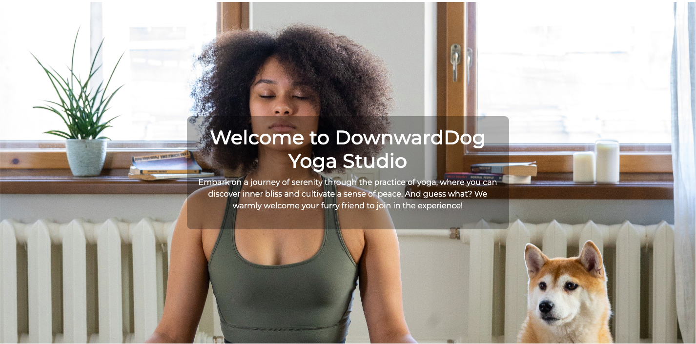

# DownwardDog Yoga Studio

This website is designed to bring together all yoga fans who are also dog owners, creating a safe place for them to practise yoga together and the opportunity for a vibrant community. 
The main focus is to be straight forward enough to save time for the user, yet to be engaging and motivating at the same time.

The user can interact with the website in various ways such as viewing relevant and uselful information on the articles page. The users, if they are registered and logged in, then can comment on the articles and also can express their opinion with a like. They can later also unlike the article, in case they changed their mind. 
The users can also see a selection of yoga classes, then also a selection of available dates and times for the relevant classes to choose from through the Yoga page. If they are logged in, they will be able to book, register their interest. After admin approval, the user is able to follow up their bookings on the My Bookings page, and also to edit or delete the bookings that they wish to.  

This full-stack framework project was built using Django framework, Python, HTML, Bootstrap and CSS. Furthermore, ElephantSQL and Cloudinary was also used to store data, images and CSS.

[Link to the live project](https://downwarddog.herokuapp.com/)

# Contents

- [User Experience (UX)](https://github.com/Lilla-Kavecsanszki/downwarddog#user-experience-ux)
  - [Ideal client](https://github.com/Lilla-Kavecsanszki/downwarddog#ideal-client)
  - [User stories & Epics](https://github.com/Lilla-Kavecsanszki/downwarddog#user-stories-and-epics)
- [Planning](https://github.com/Lilla-Kavecsanszki/downwarddog#planning)
- [Design](https://github.com/Lilla-Kavecsanszki/downwarddog#design)
  - [Wireframes](https://github.com/Lilla-Kavecsanszki/downwarddog#wireframes)
  - [Entity Relationship Diagrams](https://github.com/Lilla-Kavecsanszki/downwarddog#entity-relationshi-diagrams)
  - [Theme](https://github.com/Lilla-Kavecsanszki/downwarddog#theme)
- [Languages Used](https://github.com/Lilla-Kavecsanszki/downwarddog#languages-used)
- [Frameworks, Libraries, Programs & Technologies Used](https://github.com/Lilla-Kavecsanszki/downwarddog#frameworks-libraries-programs--technologies-used)
- [Features](https://github.com/Lilla-Kavecsanszki/downwarddog#features)
- [Deployment](https://github.com/Lilla-Kavecsanszki/downwarddog#deployment)
- [Testing](https://github.com/Lilla-Kavecsanszki/downwarddog#testing)
  - [Manual Testing](https://github.com/Lilla-Kavecsanszki/downwarddog#manual-testing)
  - [User Stories Testing](https://github.com/Lilla-Kavecsanszki/downwarddog#user-stories-testing)
  - [Further Testing](https://github.com/Lilla-Kavecsanszki/downwarddog#further-testing)
  - [Bugs](https://github.com/Lilla-Kavecsanszki/downwarddog#bugs)
- [Credits](https://github.com/Lilla-Kavecsanszki/downwarddog#credits)
  - [Content](https://github.com/Lilla-Kavecsanszki/downwarddog#content)
  - [Acknowledgments and Code](https://github.com/Lilla-Kavecsanszki/downwarddog#acknowledgments-and-code)
  - [Disclaimer](https://github.com/Lilla-Kavecsanszki/downwarddog#disclaimer)

# User Experience (UX)

### Ideal client

The ideal client for this business is:

-	English speaking
-	Practices yoga
-	A dog owner
-	Individuals, or couples or friends

Visitors of this website search for:

- A knowledgeable website that is easy to use
- That helps the user gain information about the topic of yoga, and practicing yoga with dogs
- That is reliable and accurate
- That encourage the visitors to create a communnity, through being able to communicate, comment and like articles
- That allows them to bring their dog to the yoga sessions
- That offers the visitors different choices on yoga classes to chose from
- That offers the visitors different dates and times when each classes are available
- That offers flexibility and so the user can delete a booked class in case they are no longer available

This website is the best way to help them achieve these goals because:

- The menu makes the access of different activities very easy to reach
- The content on the website is carefully curated and updated to ensure that the visitors receive reliable information
- The website offers interactive features as commenting, liking articles, encouraging the visitors to engage with the 
  contect and to create a community 
- The website offers dog-friendly yoga sessions, creating a unique yet inclusive experience for its visitors who would like to
  bring along their furry friends
- The website provides a wide range of yoga classes to chose from, allowing its visitors to choose based on their current 
  needs
- The website also displays multiple availabilities of each yoga class, allowing the visitors to choose the most convenient 
  one for their free time 
- The website offers flexibility in booking as it allows its visitors to delete a booked class, in case they are no 
  longer available, providing a hassle-free experience

This website:

- Is easy to navigate by the menu and buttons, offers an inclusive and engaging platform
- Gives the customers options and access to useful and learnable information.
- Gives the customers the information they need without overloading them or distracting them from their original ideas or
  wishes.
- Gives the customers the opportunity to connect with like-minded individuals
- Gives the the customers the opportunity to seamlessly manage their yoga sessions with their dogs

[Back to top](https://github.com/Lilla-Kavecsanszki/downwarddog#contents)

### User stories and Epics

##### Introduction and Navigation Epic

- #1  As a user, I can read the homepage so that I can get more information about the studio, the team, the approach to dogs 
      and yoga in general.
- #2  As a user, I can click on the navbar so that I go to the specific page I am interested in.

##### Account Management Epic

- #3  As a user, I can register to the website so that I have a higher level of permission and access.
- #4  As a user/admin, I can log in to the website so that I have the ability to book a class and/or comment on an article, 
      or like/unlike it.
- #5  As a user, I can see whether I logged in or registered so that I know that it was successful.
- #6  As a user, I can log out from the website so that I can protect my privacy and information.

##### Articles, Comments & Likes Epic

- #7  As a user, I can click on the article so that I can read the entire text about the topic and learn.
- #8  As a user, if I am logged in, I can like or unlike the articles so that I have the opportunity to show my interest 
      and appreciation.
- #9  As a user, if I am logged in, I can comment on the articles so that I can leave my feedback and/or thoughts 
      regarding the article.

##### Booking Epic

- #10 As a user, I can read more information about each classes so that I can choose which one suits me the best to book. 
- #11 As a user, if I am logged in, I can create a booking so that I can book and join a class.
- #12 As a user, I can choose the date of my future class so that I can book it on the date that suits my schedule.
- #13 As admin, I can authorize or disapprove booking enquiries so that I can assure that the classes are not overbooked.
- #14 As a user, if I am logged in, I can edit my booking so that I can change the number of dogs I would like to bring along
- #15 As a user, if I am logged in, I can cancel my spot, my booking, so that I can give my space back to others and I can 
    join the class when I am available.

##### Management Epic

- #16 As an admin, I can authorize or disapprove comments so that I can assure that a respectful language is used at all times.
- #17 As an admin I can create, read, update and delete articles so that I can manage the content.
- #18 As an admin I can see each booking; the day and class combination, to understand how many clients has enquired/ booked 
    it so that I can analyse popularity and busy/ weak days.

##### Contact Epic

- #20 As a user, I can fill out a contact form so that I can communicate with the management, give my feedback, leave a review to the teachers and the studio

##### Future ambition - Planned for the next sprint

- #21 create a share button to be able to share the articles
- #22 after successfully creating a booking, for the user to receive a confirmation text or email and/or reminder before the class also
- #23 users to be able to add the booking information to their calendar

(#19 US was deleted during production)

[Back to top](https://github.com/Lilla-Kavecsanszki/downwarddog#contents)

# Planning

The planning process started with determining the target clientele, by creating a Persona Profile - by using Code Institutes template - based on design thinking. Therefore the website aims to cater to the needs, expectations and preferences of the identified persona.
You can see the persona profile [HERE](README_docs/design_thinking_persona_template.pdf).

Given the prevalence of mobile usage among our target users, creating a responsive website was a top priority in our design approach. To achieve this, we leveraged the power of Bootstrap grids, elements, and responsive utilities combined with custom CSS, to ensure seamless adaptability across various devices.

### Agile Methodology

In this project Github issues were used to create the User stories and groupped into Epics, in a Github Project. This served as the Agile tool. The issues' development was managed through a Kanban board. Currently, all the issues have been marked as "Done”.

For easy access, you can find the Epics, User Stories/ Issues, and Kanban board [HERE](https://github.com/users/Lilla-Kavecsanszki/projects/5).

# Design

### Wireframes

### Entity Relationship Diagrams

To support the functionality of the DownwardDog app, five models have been designed and implemented to store essential information in databases. 

To showcase the relationships between the models, I have divided them into two categories: one relevant to the Articles and the other to the Booking functionality.

The Entity Relationship Diagrams below illustrate how the models are connected to each other for the Articles section:
- Post and Comment have a one-to-many relationship, where one post can have multiple comments, but each comment is associated with only one post.
- User and Likes have a many-to-many relationship, where multiple users can like multiple posts, and each like is linked to both a user and a post.
(- User and Post have a one-to-many relationship, where one user can be associated with multiple posts, but each post is linked to only one user (the author). This feature is however limited for the admin therefore not displayed)

Article ERD
 

The Entity Relationship Diagrams below illustrate how the models are connected to each other for the Booking section:
- Classes and Timetable have a one-to-many relationship, where one class can have multiple timetables, but each timetable is associated with only one class.
- Timetable and Booking have a one-to-many relationship, where one timetable can have multiple bookings, but each booking is linked to only one timetable.
- Booking and User have a many-to-one relationship, where one user can create many bookings. 

The unique_booking constraint in the Booking model ensures that a user can create multiple bookings, but only one booking for a specific class on a specific date/time.

Booking ERD
 

### Colour Scheme

- White
- Whitesmoke #f5f5f5
- Very dark (mostly black) cyan #141c1e
- Dark moderate lime green #48a04f
- Bright red #ed3833

[My Colour Palette](https://colorkit.co/palette/f5f5f5-f8d649-48a04f-44aedd-8f4ec4-ed3833-141c1e/)

I picked these specific colours based on the purpose of the website and what the studio wishes to achieve. I made that decision for a playful and fun aesthetics that can also give a calming effect to the visitors at the same time. 

### Typography

The primary font used for the website is Poiret One. It was chosen because I found this font to be

The secondary font used for the body is Montserrat, which was selected for its clear readability, which works well with Poiret One to maintain the airy yet fun outcome.

# Languages Use

- HTML5
- Python
- CSS3
- Javascript

[Back to top](https://github.com/Lilla-Kavecsanszki/downwarddog#contents)

# Frameworks, Libraries, Programs & Technologies Used

- [Lucid](https://lucid.app/documents#/documents?folder_id=recent) was used to create the ER Diagrams
- Github was used as the repository for the projects code after being pushed from Git
- Git was used for version control by the Gitpod terminal to commit to Git and Push to GitHub; to create and edit all
  original code
- [Google Fonts](https://fonts.google.com/) used for the Montserrat and Poiret One fonts
- [Font Awesome](https://fontawesome.com/) was used to add icons for aesthetic and UX purposes
- [Fonticon](https://gauger.io/fonticon/) was used to create the favicon
- [Bootstrap](https://getbootstrap.com/) was used to build a responsive website quicker
- Microsoft Word was used to create the wireframes during the design process.
- [Django](https://www.djangoproject.com/) was used as the framework of the application
- [Gunicorn](https://gunicorn.org/) was used as the Web Server to run Django on Heroku
- Django allauth used for account registration and authentication
- Django crispy forms used for form rendering
- Summernote used to to enable "WYSIWYG" (What You See Is What You Get) editing functionality to provide an intuitive and user-friendly interface when creating new articles
- [Cloudinary](https://cloudinary.com/) used to store the images and data used by the website
- [Heroku] was used to deploy the application and provides an enviroment in which the code can execute

[Back to top](https://github.com/Lilla-Kavecsanszki/downwarddog#contents)

# Features

## Home Page

### F01 Navigation Bar

The navigation bar provides easy access to all active pages for the user.

**Menu Options:**

- **Logo:** Essentially it indicates the name of the website, while it also serves as a button that is linked to the homepage as an instant solution for the user. The logo also includes a "jumping" paw icon in the website's signature orange colour, adding an eye-catching and playful effect that draws the user's attention to the business name
- **Home:** This button serves as a quick link to the homepage, enabling users to navigate back to the main landing page at any point.
- **Articles:** Users can explore and read articles by clicking on this button, which further leads them to a detailed page showcasing various content if they want to. The logged-in user will also be able to comment the articles or like them. The non-logged-in user can only view.
- **Yoga:** The "Yoga" button takes users to a list of available classes. Each class is presented with relevant information and a button, 'Availabilities', which through the Users can choose their preferred date and time, and go ahead to book their desired class. At the end, only logged-in user can proceed with a booking, non-logged in users will be redirected to the Login page.

##### Logged-In Users

For logged-in users, the navigation bar includes two additional menu options:

- **My Bookings:** This button provides quick access to view and manage the user's booked classes.
- **Logout:** Users can log out by clicking on this option.
  

##### Not Logged-In Visitors

For non-logged-in users, the following options are available instead:

- **Register:** Users can register and create an account to gain access to more features and personalized content.
- **Login:** Clicking on this button allows users to log in with their credentials and access personalized content and more features.
  

##### Special Case for Administrators

When the signed-in user is the admin user or superuser, an additional link labeled "Admin" is displayed on the navigation bar.

- **Admin:** This link grants access to the Django Admin window, allowing the superuser to manage the website's data, such as adding new, modifying, deleting or using them.
  

##### Decorative Element

On the right-hand side of the navigation bar, a muted text adds a touch of decoration. If a user is logged in, their username, along side by a user icon, is displayed. Otherwise, the text "Breathe.. or bark?" is shown, adding a playful and welcoming touch to the user interface.

The navigation bar is fully responsive, adjusting to different screen sizes, and it collapses on mobile screens, displaying a hamburger icon for easy navigation.

### F02 Hero Image and Overlay Text

Underneath the navbar, the Home page features a very relevant photo of a woman doing yoga with a dog next to her. There is also a text overlay on top of the image, displaying the name of the website and the business, and also gives a clear idea of its purpose too.

### F03 Encouragement Text and Get started button

Underneath the hero image, there is a larger text displayed, that encouraging the user to discover the available classes and with the button below it, instantly leads to the goal of the website, which is to get the user to book a class/ classes. The button therefore directs the user to the Yoga page, that lists the classes that can be booked.

### F04 Story and Team

Below F03 the user can see a section that includes 2 parts, where the website offers an introduction to the business namely its Story and its Team. On the opposite side of the texts, a stylized image of a stretching pug is displayed as a decorative element, visually capturing the essence and ambiance of the business.

### F05 Contact section

F05 includes a section through that the user can find the business and/or reach out. The title on top makes this purpose very clear, then underneath of that the address is shown. On the opposite side, a contact form is provided. The user is required to fill in their name, email, and message before they can submit the form using the 'Send Message' button. The button is disabled until all required fields are correctly filled out. Additionally, the email field validates the input to ensure it includes an '@' sign before submission. 

When the contact form is filled out as required and submitted, the user will see a reassuring message popping up in green, letting them know that their message was successfully sent, then will also disappear in 2 seconds.
In case of an error, and so failure of sending the message, a red message pops up informing the user that the submition failed and prompts them to try again.

### F06 Footer 

Just as the navigation bar, the footer is also presented on each page. It is at the very bottom, displaying information about the website creator, along with convenient links to the developer's Github and LinnkedIn profils. It also shows a disclaimer, clarifying that the website was created for educational use only. 

## Articles page

### F07 List of the articles

On this page, users can browse through four articles per page, each displaying their titles, relevant images, author names, publication dates, and the number of likes they have received. 
Pagination allows users to navigate to the next set of four articles using the "Next" button located below the last article. 

### F08 Articles Detail page

By clicking on the article titles, users are brought onto the Articles Detail page to read the full content and view likes, and any associated and approved comments.

Logged-in users have additional privileges, as they can like and comment on the articles as well. This enhanced functionality enriches the overall user experience and encourages engagement with the content and other users in the community. 
Likes are explained in F09, and Comments in F10 in more detail.

### F09 Like an article

In order for a user to like an article, they must first log in to their account. Once logged in, they can proceed to view the article's full content on the Articles Detail page and there simply click on the heart icon displayed beneath the article's content.
If the user changes their mind, they can click on the heart icon again to unlike the article. 
When the article is liked by the current user, the heart icon appears filled with the website's distinctive orange color. Additionally, a like counter is displayed next to the heart icon, indicating the number of likes the article has received from all the users.

### F10 Comment on an article

In order for a user to comment on an article, they again must first log in to their account. Once logged in, they can proceed to view the article's full content on the Articles Detail page and there scroll to the bottom. There, next to the existing Comments section, there is a form to leave their own comment. A clear message prompts the user to leave a comment and where it should be filled in. The username also appears above the form, showing who the comment will come from. The user needs to type in their comment into the text box then press the submit button. All comments then must be approved by the administrator before they will be visible on the Articles Detail page. Once approved, the comments will appear in the comments section at the bottom of the Articles Detail page, starting with the latest one.

For the admin to approve a comment, they need to log in to the admin pages. There they need to click onto the Comments table, tick and select the comment or comments that they wish to authorise, choose the 'Approve Comments' button from the drop-down menu and finally click on 'Go'.
The second way to achieve the same is to click on the individual comment (on the name row) and there select 'Approved' box then finally press save.

There is also a comment counter, next to the like counter, that tracks the number of comments were approved for the specific article.

## Yoga page

### F11 Video background and Overlay Text

The top of the Yoga page features a muted video of a girl doing yoga with a dog next to her. The video serves as a motivation for users to start moving as soon as they see it. To blend the video into its environment, there is a faded black overlay on top of it. Additionally, there is a text overlay suggesting the purpose of the page, and a "jumping" arrow urges the user to scroll down to explore the different yoga classes available to choose from.

### F12 Yoga Class Cards

Underneath the video, users can view the different yoga classes and relevant information about them, presented on orange cards. Each class has an 'Availabilities' button that takes the user to the Yoga Detail page of the chosen class. The Yoga Detail page is also detailed under F13.

### F13 Yoga Detail Cards

The Yoga Detail cards are displayed on the Yoga Detail page, which looks exactly the same as the Yoga page. The difference is the content of the orange cards, that this time are the yoga detail cards.
The cards show the available dates and times of the chosen class. Underneath that information on each card there is a dropdown menu, where the user can select how many dog or dogs they wish to bring to the chosen class. The default is set to 1. After the user choses this detail and if they are logged in, they can proceed and book through the cards' own 'Book Now' button. If the user is not logged in, then the button will redirect them to the Sign in page. The Book Now button is explained further in details in F15.

### F14 Warning Text

Above the yoga detail cards on the yoga detail page, a polite warning message is displayed, explaining that users need to be logged in to book a class.

### F15 Book Now

As mentioned in F13, the "Book Now" button redirects users to the Sign-in page if they are not logged in. However, for logged-in users, it handles the creation of a booking.

When the logged-in user press the "Book Now" button, it takes them to the My Bookings page, displaying the relevant titles and paragraphs from that, which is in this case a pending status.

If a logged-in user attempts to press the "Book Now" button twice for the same class, date and time, the constraints in the Booking model prevent that. The user will be redirected to the "My Bookings" page, where they will see a message explaining that they have already attempted to book this class and should wait for approval.

For the admin to approve a booking, they need to log in to the admin pages. There they need to click onto the Bookings table, tick and select the booking or bookings that they wish to authorise, choose the 'Approve bookings' button from the drop-down menu and finally click on 'Go'.
The second way to achieve the same is to click on the individual booking (on the user row) and there select 'Approved' box then finally press save.

## F16 My Bookings page

Logged-in users enjoy an additional option on their navbar: the "My Bookings" page. This page conveniently lists all approved bookings for the user, including the class title, username, date and time, and the number of dogs that it was booked with.
Underneath there is also a friendly and welcoming message says: See you soon! 
Under each booking in the list, users will find two buttons and a dropdown menu. The "Delete" button, detailed later in F17, allows users to cancel their bookings. On the other hand, the "Update" button, along with the dropdown menu (F18), serves to modify booking details as needed.
Additionally, a disclaimer appears at the bottom of the page, informing users that all bookings are subject to admin approval.

In case the user has no (approved) bookings yet, the "My Bookings" page will display a special message indicating that the user currently has no bookings. This message serves as a notification that the user has not yet made any bookings, encouraging them to explore available classes and make their first booking.

### F17 Delete button

When the user clicks on the "Delete" button, a confirmation dialog box pops up, prompting the user to confirm whether they really want to cancel their booking. If the user decides not to proceed with the cancellation, they can click on "Cancel," and the booking will remain intact, and they will stay on the same page with all their bookings visible. However, if they click on "OK," the booking will be deleted. The page will then refresh automatically, and the deleted booking will no longer appear in the list of approved bookings, giving the user a clear indication that the cancellation was successful.

### F18 Update button and Dropdown

On the opposite side of the "Delete" button, the user has the option to update the number of dogs they wish to bring with them to the booked class. They can do this by selecting the desired number from a dropdown menu. The dropdown menu allows the user to choose any number between 1 and 5, with 5 being the maximum number of dogs they can bring. 

After selecting the new number of dogs from the dropdown menu, the user can proceed by clicking the "Update" button. Upon clicking the button, the page will automatically refresh. The booking will then reappear in the list of approved bookings, displaying the updated number of dogs, providing the user with a clear indication that the update was successful. This process also ensures that the user's changes are reflected accurately in the booking details, allowing them to see the latest information without any confusion or delay.

## F19 User Authentication

The website also offers a range of personalized experiences for its users while ensures secure access to them with authentication. 

**Registration**

Before accessing the site's secured features, users are required to complete the registration process. As mentioned in F01, the "Register" option is available on the navigation bar when there is no user logged in. During registration, users need to provide a unique username that has not been previously registered, an optional email address, and a password, which must be entered twice to ensure accuracy.
"Finally, they need to click the 'Sign Up' button, which will create their new account instantly and display a green message confirming their successful sign-in under their new username."

**Login**

After successful registration, users can then sign in (button next to "Register" on the navbar) anytime and access the site's secured functionalities:

- option to comment on an article
- option to like an article
- possibility to book, cancel or change a booking
  
To sign in, users have to enter their registered username, the corresponding password and click the "Sign In" button.
After successfully signing in, a reassuring message will pop up in green, notifying the user that they have been successfully signed in to their account. This message serves as confirmation and provides a positive user experience, mentioning the username also, under the login happened.

**Logout**

Once the user is signed in, they will see the "Logout" button on their navigation bar and they can easily log out by simply clicking on it. Upon clicking the link, a confirmation prompt will appear, and the user can complete the sign-out process by clicking the "Sign Out" button on the page.
A reassurring message will pop in again in green, informing the user that they have indeed signed out.

## Admin page

When the superuser or admin is logged in, they have an additional option on the navbar; "Admin". The superuser can use this button to navigate seamlessly onto the administrator page to manage the website and its functionalities detailed in the below features.
The admin can also access this page by adding '/admin' to the website URL.

### F20 Add an Article

To add a new article, the admin can use the "+ Add Post" button at the top right corner of the Posts table after opening that and then fill in the required data fields for the article. Each post must have a unique title, and a slug will be automatically generated based on the title as it is typed in. If the admin does not upload a specific image for the article, a default image will be used.
Articles can be saved as a "Draft" also, which is the default status. This means those articles are not visible on the Articles page until their status is chnaged to be "Published." This feature helps the admin to save their work before it is completely finished or agreed to by the management team for example and so can complete it at a later time to make it visible to the viewers.

### F21 Add a Class

The admin provides Yoga class information by creating them on the admin page in the Classes table. To add a new class, the admin can use the "+ Add Classes" button at the top right corner of the Classes table after opening that and then fill in the required data fields for the yoga class. Each post must have a unique title/name, and a slug will be automatically generated based on the title as it is typed in, as well as a descriptive text and duration time, indication how long the class will last.
Classes can be saved as a "Draft" also, which is the default status. This means those classes are not visible on the Yoga page until their status is chnaged to be "Published." This feature helps the admin to save their work before it is completely finished or agreed to by the management team for example and so can complete it at a later time to make it visible to the viewers.

### F22 Add a Timetable

The admin provides timetable information for each existing class by creating them on the admin page in the Timetables table. To add a new availability, the admin clicks on the '+ Add Timetable' button at the top right corner of the Timetables table. They then choose the class for which they would like to create the new availability and add the date and time, as well. Once the new timetable is created, it becomes visible and available to book on the yoga detail page of the selected class.

[Back to top](https://github.com/Lilla-Kavecsanszki/downwarddog#contents)

## Future ambitions

- Integrate the onclick message that pops up when the user attempts to delete a booking
- Create a share button to be able to share the articles
- After sumbition of a comment, the page to refresh in a way so that the user could leave another comment
- After successfully creating a booking, for the user to receive a confirmation text or email and/or reminder before the class also
- Users to be able to add the booking information to their calendar

# User Story - Feature Crossreference table

How the Features align with and fulfill the User Stories by providing the necessary functionality and interactions that meet the users' needs and requirements.

# Deployment

**How to Clone**

Steps
 

1. Go to the <https://github.com/Lilla-Kavecsanszki/downwarddog> repository.
2. Click the Code button to the left of the green Gitpod button, then choose Local.
3. Click on headings for HTTPS, SSH, and Github CLI to find their individual URL links. Choose the HTTPs one.
4. Open your own terminal in your editor and change the current working directory to the location of where you want
   the cloned directory to be.
5. In the terminal type git clone, and then paste the URL you copied from the repository page.
6. Press enter to complete.

 

**How to Fork**

Steps
 

1. Go to the <https://github.com/Lilla-Kavecsanszki/downwarddog> repository.
2. Click the fork button in the top right of the screen, between the watch, and the star buttons.

 

**Github & Deployment to Heroku**

Steps
 

The DownwardDog website is deployed using Heroku, this was done based on the: [CI Django Blog Cheat Sheet](README_docs/django_blog_cheat_sheet.pdf)

- Create a Heroku application by pressing "New" on located on the upper right side of the main page
- Select: 'Create new app' from the dropdown menu.
- Go to the next page, fill the form with the following data: 'App name' and 'Choose a region' 
- Press 'Create app'

- When the Heroku app is created, go to 'Settings'
- Scroll to 'Config Vars', press 'Reveal Config Vars' button  
- Enter the KEY and VALUE for:

DATABASE_URL:
- To create DATABASE_URL, log in to  ElephantSQL
- Press 'Create New Instance' 
- Fill out the form, where you select a plan and name. 

 

[Back to top](https://github.com/Lilla-Kavecsanszki/downwarddog#contents)

# Testing

W3C HTML Validator result
 
to validate all HTML code written and used in this website

W3C CSS Validator result
 
to validate all CSS code written and used in this website

JS Hint result
 
to validate the javascript code written used in this website

CI Python Linter - views.py
 
to validate python code written and used in the views.py

CI Python Linter - models.py
 
to validate python code written and used in the models.py

CI Python Linter - forms.py
 
to validate python code written and used in the forms.py

CI Python Linter - admin.py
 
to validate python code written and used in the admin.py

CI Python Linter - application urls.py
 
to validate python code written and used in the app's urls.py

CI Python Linter - project urls.py
 
to validate python code written and used in the project's urls.py

CI Python Linter - project settings.py
 
to validate python code written and used in the project's settings.py

## Manual Testing

The table provided below presents the test cases that were utilized, with the corresponding results, and references to the corresponding Feature IDs that each test case addressed. These test cases were primarily designed based on the Acceptance Criteria specified for each User Story.

Details
 
[Manual Testing Document](README_docs/design_thinking_persona_template.pdf)

All tests passed successfully, indicating that the specified features and functionalities are working as intended.

[Back to top](https://github.com/Lilla-Kavecsanszki/downwarddog#contents)

### Further testing

Details
 
I asked friends and family to look at the application on their browsers and report any issues they find. This time my focus was on UX and how understandable and easy the application is to use.

[Back to top](https://github.com/Lilla-Kavecsanszki/downwarddog#contents)

## Bugs

An issue came up while testing the application in the meantime;

- The 'Delete Product' function got into some issues when attempting to delete an existing product due to case sensitivity. Specifically, the function was unable to locate a product if it was inputted in lowercase or capitalized incorrectly. To address this issue, I utilized the capitalize() method in both the get_new_product() and get_deleted_product() functions. This modification ensures that the user inputs are formatted to start with a capital letter, regardless of their original input. As a result, the application can accurately locate and delete the requested products.

[Back to top](https://github.com/Lilla-Kavecsanszki/downwarddog#contents)

# Credits

## Content 

[Back to top](https://github.com/Lilla-Kavecsanszki/downwarddog#contents)

## Acknowledgments and Code

I received inspiration for this project from my personal experience working in the hospitality industry, as well as from my partner's struggles with similar issues at his job. These experiences helped me figure the logic for this project greatly. In addition, I reviewed the work of other students to gain a better understanding of project scope and to identify best practices for Milestone Project 3.

The below websites have been used to understand the logic of building this project with Python.

I also would like to express my gratitude to Elaine Roche, my mentor, and the tutoring team for their continuous support and valuable feedback. Their guidance, tips, and resources have been instrumental in my coding and testing skills.

## Disclaimer

This application is for educational use only.

[Back to top](https://github.com/Lilla-Kavecsanszki/downwarddog#contents)

Article Sources:

https://www.health.harvard.edu/staying-healthy/yoga-benefits-beyond-the-mat

https://www.theguardian.com/lifeandstyle/2023/jun/14/desk-yoga-de-stress-office-india-y-break

https://www.yogabasics.com/explore/yogic-lifestyle/yogic-diet/yogic-diet-guide/

https://www.yogajournal.com/lifestyle/yoga-trends/practice-yoga-dog/

https://www.shutterstock.com/video/editorial/search/puppy-yoga

Inspiration:

<<https://triyoga.co.uk/>

https://en.wikipedia.org/wiki/Doga_(yoga)

https://getbootstrap.com/docs/5.0/forms/select/

https://docs.djangoproject.com/en/4.2/

<https://getbootstrap.com/docs/5.0/getting-started/introduction/>

<https://stackoverflow.com/questions/34586259/how-to-organize-js-files-in-django>

<https://stackoverflow.com/questions/61020923/displaying-videos-in-django-template-media-link>

https://stackoverflow.com/questions/56969479/adding-video-field-in-django

https://docs.djangoproject.com/en/2.2/topics/http/file-uploads/

<https://pythonguides.com/if-statement-in-django-template/>

<https://stackoverflow.com/questions/65880813/passing-id-to-django-url>

https://stackoverflow.com/questions/46860710/django-linking-a-html-page-to-a-view

https://stackoverflow.com/questions/42628883/object-id-in-dja

<https://stackoverflow.com/questions/26334133/passing-an-id-to-a-url-link-django>

https://stackoverflow.com/questions/25345392/how-to-add-url-parameters-to-django-template-url-tag

<https://stackoverflow.com/questions/44437706/django-render-redirect-to-page-with->

<https://stackoverflow.com/questions/11293380/django-catching-integrity-error-and-showing-a-customized-message-using-template>

<https://docs.djangoproject.com/en/3.2/ref/models/querysets/>

Message alert and Reloading the page

https://stackoverflow.com/questions/30050678/show-bootstrap-alert-box-on-a-button-click

https://stackoverflow.com/questions/16955019/how-to-reload-a-page-after-the-ok-click-on-the-alert-page

https://www.w3schools.com/howto/howto_js_alert.asp

https://stackoverflow.com/questions/32394684/how-to-confirm-and-call-function-with-onclick

Rename the body field in the Comment form

https://docs.djangoproject.com/en/4.2/topics/forms/

https://stackoverflow.com/questions/73686042/how-do-i-label-fields-on-a-django-form

Dropdown HTML

https://www.freecodecamp.org/news/html-drop-down-menu-how-to-add-a-drop-down-list-with-the-select-element/

https://stackoverflow.com/questions/26450696/get-user-id-with-request-post-get-works-but-value-seems-to-be-no-integer

Bugs:
- EmailJS... was not connected properly, didnt copy the correct template parameters
- slug not working for the Booking view-url, needed to the ID parameter - based on error code suggestion in Debug=True mode