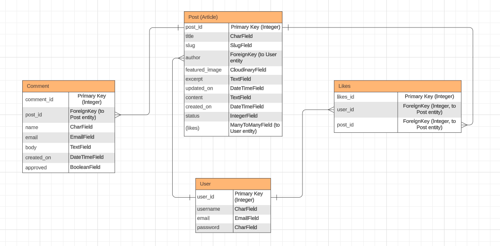
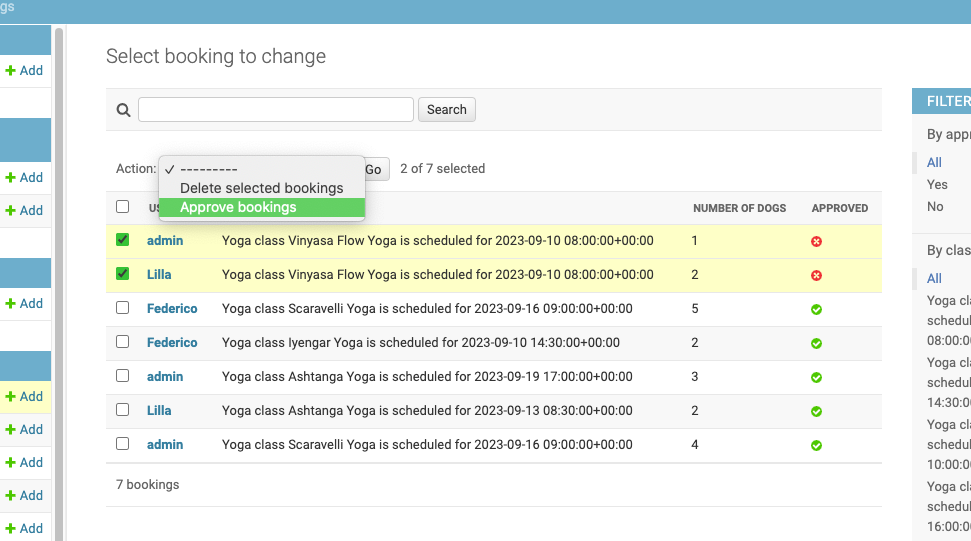

# DownwardDog Yoga Studio

This website is designed to bring together all yoga fans who are also dog owners, creating a safe place for them to practise yoga together and the opportunity for a vibrant community. 
The main focus is to be straightforward enough to save time for the user, yet engaging and motivating at the same time. The primary goal is for the user to book classes efficiently.

The users can interact with the website in various ways, such as viewing relevant and useful information on the articles page. If the users are registered and logged in, they can comment on the articles and express their opinions with a like too. They can also unlike the article if they change their mind. Additionally, users can view a selection of yoga classes and available dates and times for the relevant classes on the Yoga page. If they are logged in, they will be able to book and register their interest. After admin approval, the users can follow up on their bookings on the My Bookings page and also edit or delete the bookings they wish to.

This full-stack project was built using the Django framework, Python, HTML, Bootstrap, and CSS. Additionally, ElephantSQL and Cloudinary were used to store data, images, and static files.

[Link to the live project](https://downwarddog.herokuapp.com/)

# Contents

- [User Experience (UX)](https://github.com/Lilla-Kavecsanszki/downwarddog#user-experience-ux)
  - [Ideal client](https://github.com/Lilla-Kavecsanszki/downwarddog#ideal-client)
  - [User stories & Epics](https://github.com/Lilla-Kavecsanszki/downwarddog#user-stories-and-epics)
- [Planning](https://github.com/Lilla-Kavecsanszki/downwarddog#planning)
- [Design](https://github.com/Lilla-Kavecsanszki/downwarddog#design)
  - [Wireframes](https://github.com/Lilla-Kavecsanszki/downwarddog#wireframes)
  - [Entity Relationship Diagrams](https://github.com/Lilla-Kavecsanszki/downwarddog#entity-relationship-diagrams)
  - [Theme](https://github.com/Lilla-Kavecsanszki/downwarddog#theme)
- [Languages Used](https://github.com/Lilla-Kavecsanszki/downwarddog#languages-used)
- [Frameworks, Libraries, Programs & Technologies Used](https://github.com/Lilla-Kavecsanszki/downwarddog#frameworks-libraries-programs--technologies-used)
- [Features](https://github.com/Lilla-Kavecsanszki/downwarddog#features)
- [User Story - Features Cross-Reference table](https://github.com/Lilla-Kavecsanszki/downwarddog#user-story---features-cross-reference-table)
- [Deployment](https://github.com/Lilla-Kavecsanszki/downwarddog#deployment)
- [Testing](https://github.com/Lilla-Kavecsanszki/downwarddog#testing)
  - [Manual Testing](https://github.com/Lilla-Kavecsanszki/downwarddog#manual-testing)
  - [Further Testing](https://github.com/Lilla-Kavecsanszki/downwarddog#further-testing)
  - [Bugs](https://github.com/Lilla-Kavecsanszki/downwarddog#bugs)
- [Credits](https://github.com/Lilla-Kavecsanszki/downwarddog#credits)
  - [Media and Content](https://github.com/Lilla-Kavecsanszki/downwarddog#media-and-content)
  - [Acknowledgments and Code](https://github.com/Lilla-Kavecsanszki/downwarddog#acknowledgments-and-code)
  - [Disclaimer](https://github.com/Lilla-Kavecsanszki/downwarddog#disclaimer)

# User Experience (UX)

### Ideal client

The ideal client for this business is:

-	English speaking
-	Practices yoga
-	Dog owners
-	Individuals, or couples or friends

Visitors of this website search for:

- A user-friendly and informative website that provides reliable and accurate information about yoga and practicing yoga with dogs.
- Features that encourage community engagement, such as the ability to communicate, comment, and like articles.
- The option to bring their dogs to yoga sessions, promoting a pet-friendly environment.
- A variety of yoga classes to choose from, offering different styles and dates to cater to individual preferences.
- Flexible booking options, allowing users to delete booked classes if their availability changes or adjust the number of dogs they want to bring along.

This website is the best way to help them achieve these goals because:

- The user-friendly menu makes accessing different activities very easy and intuitive.
- The website's content is carefully curated and regularly updated to provide reliable and up-to-date information to the visitors.
- Interactive features such as commenting and liking articles encourage visitors to engage with the content and create a sense of community.
- With dog-friendly yoga sessions, the website offers a unique and inclusive experience for visitors who want to bring their furry friends along.
- The website provides a diverse selection of yoga classes, catering to various styles, ensuring there is something for everyone.
- Multiple availabilities of each yoga class are displayed, allowing visitors to choose the most convenient time for their schedule.
- The website's flexibility in booking enables visitors to delete a booked class if their availability changes, or to edit the number of dogs they wish to bring along, providing a seamless and convenient experience.

This website:

- Is easy to navigate by the menu and buttons, offers an inclusive and engaging platform.
- Gives the customers options and access to useful and learnable information.
- Gives the customers the information they need without overloading them or distracting them from their original ideas or wishes.
- Gives the customers the opportunity to connect with like-minded individuals.
- Gives the the customers the opportunity to seamlessly manage their yoga sessions with their dogs.

[Back to top](https://github.com/Lilla-Kavecsanszki/downwarddog#contents)

### User stories and Epics

#### Introduction and Navigation Epic

- #1  As a user, I can read the homepage so that I can get more information about the studio, the team, the approach to dogs and where to find them.
- #2  As a user, I can click on the navbar so that I go to the specific page I am interested in.

#### Account Management Epic

- #3  As a user, I can register to the website so that I have a higher level of permission and access.
- #4  As a user/admin, I can log in to the website so that I have the ability to book a class and/or comment on an article, or like/unlike it.
- #5  As a user, I can see whether I logged in or registered so that I know that it was successful.
- #6  As a user, I can log out from the website so that I can protect my privacy and information.

#### Articles, Comments & Likes Epic

- #7  As a user, I can click on the article so that I can read the entire text about the topic and learn.
- #8  As a user, if I am logged in, I can like or unlike the articles so that I have the opportunity to show my interest and appreciation.
- #9  As a user, if I am logged in, I can comment on the articles so that I can leave my feedback and/or thoughts regarding the article.

#### Booking Epic

- #10 As a user, I can read more information about each classes so that I can choose which one suits me the best to book.
- #11 As a user, if I am logged in, I can create a booking so that I can book and join a class.
- #12 As a user, I can choose the date of my future class so that I can book it on the date that suits my schedule.
- #13 As admin, I can authorise booking enquiries so that I can assure that the classes are not overbooked.
- #14 As a user, if I am logged in, I can edit my booking so that I can change the number of dogs I would like to bring along
- #15 As a user, if I am logged in, I can cancel my spot, my booking, so that I can give my space back to others and I can join the class when I am available.

#### Management Epic

- #16 As an admin, I can authorise comments so that I can assure that a respectful language is used at all times.
- #17 As an admin I can create, read, update and delete articles so that I can manage the content.
- #18 As an admin I can add and manage Classes and their Timetables so that I can keep the selection up to date.
  
#### Contact Epic

- #20 As a user, I can fill out a contact form so that I can communicate with the management, give my feedback, leave a review to the teachers and the studio

(Note: User Story #19 was removed during production and is no longer part of the project scope.)

[Back to top](https://github.com/Lilla-Kavecsanszki/downwarddog#contents)

# Planning

The planning process began by identifying the target clientele, which involved creating a Persona Profile using Code Institute's template based on design thinking principles. This Persona Profile helps in understanding the needs, expectations, and preferences of the identified persona, and the website is designed to cater to these specific requirements.
You can see the persona profile [HERE](README_docs/design_thinking_persona_template.pdf).

Given the prevalence of mobile usage among our target users, creating a responsive website was a top priority in our design approach. To achieve this, we leveraged the power of Bootstrap grids, elements, and responsive utilities combined with custom CSS, to ensure seamless adaptability across various devices.

### Agile Methodology

In this project Github issues were used to create the User stories and groupped into Epics, in a Github Project. This served as the Agile tool. The issues' development was managed through a Kanban board. Currently, all the issues have been marked as "Done”.

For easy access, you can find the Epics, Issues/ User Stories with their Acceptance Criteria and Kanban board [HERE](https://github.com/users/Lilla-Kavecsanszki/projects/5).

[Back to top](https://github.com/Lilla-Kavecsanszki/downwarddog#contents)

# Design

### Wireframes

[Desktop Wireframes](README_docs/wireframes_desktop.pdf)

[Tablet Wireframes](README_docs/wireframes_ipad.pdf)

[Mobile Wireframes](README_docs/wireframes_mobile.pdf)

### Entity Relationship Diagrams

To support the functionality of the DownwardDog app, five models have been designed and implemented to store essential information in databases.

To showcase the relationships between the models, I have divided them into two categories: one relevant to the Articles and the other to the Booking functionality.
The Likes and User tables in the ER diagrams are for conceptual representation only and do not directly correspond to the models.py file or the physical database tables. They provide a logical view of data relationships without showing all the actual database details managed by Django and the database system.

The Entity Relationship Diagrams below illustrate how the models are connected to each other for the Articles section:

- Post and Comment have a one-to-many relationship, where one post can have multiple comments, but each comment is associated with only one post.
- User and Likes have a many-to-many relationship, where multiple users can like multiple posts, and each like is linked to both a user and a post.
- User and Post have a one-to-many relationship, where one user can be associated with multiple posts, but each post is linked to only one user (the author). This feature is however limited for the admin.

Article ERD
 

The Entity Relationship Diagrams below illustrate how the models are connected to each other for the Booking section:

- Classes and Timetable have a one-to-many relationship, where one class can have multiple timetables, but each timetable is associated with only one class.
- Timetable and Booking have a one-to-many relationship, where one timetable can have multiple bookings, but each booking is linked to only one timetable.
- Booking and User have a many-to-one relationship, where one user can create many bookings.

The unique_booking constraint in the Booking model ensures that a user can create multiple bookings, but only one booking for the same class on the same date/time.

Booking ERD
 

### Theme

- White #fff
- Whitesmoke #f5f5f5
- Chardon #f2eae3
- Red Damask #c36d4e
- Wood Bark #322925

I picked these specific colours based on the purpose of the website and what the studio wishes to achieve. I made that decision for a playful and fun aesthetics that can also give a calming effect to the visitors at the same time.

### Typography

The primary font used for the website is Poiret One. It was chosen because I found this font to be visually appealing, modern, and fits well with the overall theme of the studio.

The secondary font used for the body is Montserrat, which was selected for its clear readability, which works well with Poiret One to maintain the airy yet fun outcome.

[Back to top](https://github.com/Lilla-Kavecsanszki/downwarddog#contents)

# Languages Used

- HTML5
- Python
- CSS3
- Javascript

[Back to top](https://github.com/Lilla-Kavecsanszki/downwarddog#contents)

# Frameworks, Libraries, Programs & Technologies Used

- [Balsamiq](https://balsamiq.com/) was used to create the Wireframes
- [Lucid](https://lucid.app/documents#/documents?folder_id=recent) was used to create the ER Diagrams
- [ColorKit](https://colorkit.co/) was used to create the colour palette.
- Github was used as the repository for the projects code after being pushed from Git
- CodeAnywhere was used for version control, allowing me to commit changes and push them to GitHub directly from the CodeAnywhere terminal. It was the primary tool used for creating and editing all the code.
- [Google Fonts](https://fonts.google.com/) used for the Montserrat and Poiret One fonts
- [Font Awesome](https://fontawesome.com/) was used to add icons for aesthetic and UX purposes
- [Fonticon](https://gauger.io/fonticon/) was used to create the favicon
- [Bootstrap](https://getbootstrap.com/) was used to build a responsive website quicker
- Microsoft Word was used to create the wireframes during the design process.
- [Django](https://www.djangoproject.com/) was used as the framework of the application
- [Gunicorn](https://gunicorn.org/) was used as the Web Server to run Django on Heroku
- Django allauth used for account registration and authentication
- Django crispy forms used for form rendering
- Summernote used to to enable "WYSIWYG" (What You See Is What You Get) editing functionality to provide an intuitive and user-friendly interface when creating new articles
- [Cloudinary](https://cloudinary.com/) used to store all of static files and images
- [EmailJS](https://www.emailjs.com/) was used to create the contact form functionality
- [Heroku](https://heroku.com/) was used to deploy the application and provides an enviroment in which the code can execute

[Back to top](https://github.com/Lilla-Kavecsanszki/downwarddog#contents)

# Features

## Home Page

### F01 Navigation Bar

The navigation bar provides easy access to all active pages for the user.

**Menu Options:**

- **Logo:** Essentially it indicates the name of the website, while it also serves as a button that is linked to the homepage as an instant solution for the user. The logo also includes a "jumping" paw icon in the website's signature orange colour, adding an eye-catching and playful effect that draws the user's attention to the business name.
- **Home:** This button serves as a quick link to the homepage, enabling users to navigate back to the main landing page at any point.
- **Articles:** Users can explore and read articles by clicking on this button, which further leads them to a detailed page showcasing various content if they want to. The logged-in user will also be able to comment the articles or like them. The non-logged-in user can only view.
- **Yoga:** The "Yoga" button takes users to a list of available classes. Each class is presented with relevant information and a button, 'Availabilities', which through the Users can choose their preferred date and time, and go ahead to book their desired class. At the end, only logged-in user can proceed with a booking, non-logged in users will be redirected to the Login page.

##### Logged-In Users

For logged-in users, the navigation bar includes two additional menu options:

- **My Bookings:** This button provides quick access to view and manage the user's booked classes.
- **Logout:** Users can log out by clicking on this option.
  

##### Not Logged-In Visitors

For non-logged-in users, the following options are available instead:

- **Register:** Users can register and create an account to gain access to more features and personalized content.
- **Login:** Clicking on this button allows users to log in with their credentials and access personalized content and more features.
  

##### Special Case for Administrators

When the signed-in user is the admin user or superuser, an additional link labeled "Admin" is displayed on the navigation bar.

- **Admin:** This link grants access to the Django Admin window, allowing the superuser to manage the website's data, such as adding new, modifying, deleting or using them.
  

##### Decorative Element

On the right-hand side of the navigation bar, a muted text adds a touch of decoration. If a user is logged in, their username, along side by a user icon, is displayed. Otherwise, the text "Breathe.. or bark?" is shown, adding a playful and welcoming touch to the user interface.

The navigation bar is fully responsive, adjusting to different screen sizes, and it collapses on mobile screens, displaying a hamburger icon for easy navigation.

### F02 Hero Image and Overlay Text

Underneath the navbar, the Home page features a very relevant photo of a woman doing yoga with a dog next to her. There is also a text overlay on top of the image, displaying the name of the website and the business, and also gives a clear idea of its purpose.

### F03 Encouragement Text and Get started button

Underneath the hero image, there is a larger text displayed, that encouraging the user to discover the available classes and with the button below it, instantly leads to the goal of the website, which is to get the user to book a class/ classes. The button therefore directs the user to the Yoga page, that lists the classes that can be booked.

### F04 Story and Team

Below F03 the user can see a section that includes 2 parts, where the website offers an introduction to the business namely its Story and its Team. On the opposite side of the texts, images of a stretching pug are displayed as decorative elements, visually capturing the essence and ambiance of the business.

### F05 Contact section

F05 includes a section through that the user can find the business and/or reach out. The title on top makes this purpose very clear, then underneath of that the address is shown. On the opposite side, a contact form is provided. The user is required to fill in their name, email, and message before they can submit the form using the 'Send Message' button. The button is disabled until all required fields are correctly filled out. Additionally, the email field validates the input to ensure it includes an '@' sign before submission.

When the contact form is filled out as required and submitted, the user will see a reassuring message popping up in green, letting them know that their message was successfully sent, then will also disappear in 2 seconds. In case of an error, and so failure of sending the message, a red message pops up informing the user that the submition failed and prompts them to try again.

### F06 Footer

Just as the navigation bar, the footer is also presented on each page. It is at the very bottom, displaying information about the website creator, along with convenient links to the developer's Github and LinkedIn profils. It also shows a disclaimer, clarifying that the website was created for educational use only.

## Articles page

### F07 List of the articles

On this page, users can browse through four articles per page, each displaying their titles, relevant images, author names, publication dates, and the number of likes they have received.
Pagination allows users to navigate to the next set of four articles using the "Next" button located below the last article.

### F08 Articles Detail page

By clicking on the article titles, users are brought onto the Articles Detail page to read the full content and view likes, and any associated and approved comments.

Logged-in users have additional privileges, as they can like and comment on the articles as well. This enhanced functionality enriches the overall user experience and encourages engagement with the content and other users in the community.
Likes are explained in F09, and Comments in F10 in more detail.

### F09 Like an article

In order for a user to like an article, they must first log in to their account. Once logged in, they can proceed to view the article's full content on the Articles Detail page and there simply click on the heart icon displayed beneath the article's content.
If the user changes their mind, they can click on the heart icon again to unlike the article.
When the article is liked by the current user, the heart icon appears filled with the website's distinctive orange color. Additionally, a like counter is displayed next to the heart icon, indicating the number of likes the article has received from all the users. This is also shown on the Articles page, at the bottom of each article cards.

### F10 Comment on an article

In order for a user to comment on an article, they again must first log in to their account. Once logged in, they can proceed to view the article's full content on the Articles Detail page and there scroll to the bottom. There, next to the existing Comments section, there is a form to leave their own comment. A clear message prompts the user to leave a comment and where it should be filled in. The username also appears above the form, showing who the comment will come from. The user needs to type in their comment into the text box then press the submit button. When the form is filled out as required and submitted, the user will see a reassuring message popping up in green, at place of the comment form, letting them know that their feedback was successfully sent.
All comments then must be approved by the administrator before they will be visible on the Articles Detail page. Once approved, the comments will appear in the comments section at the bottom of the Articles Detail pag.

For the admin to approve a comment, they need to log in to the admin pages. There they need to click onto the Comments table, tick and select the comment or comments that they wish to authorise, choose the 'Approve Comments' button from the drop-down menu and finally click on 'Go'.
The second way to achieve the same is to click on the individual comment (on the name row) and there select 'Approved' box then finally press save.

There is also a comment counter, next to the like counter, that tracks the number of comments were approved for the specific article.

## Yoga page

### F11 Video background and Overlay Text

The top of the Yoga page features a muted video of a girl doing yoga with a dog next to her. The video serves as a motivation for users to start moving as soon as they see it. To blend the video into its environment, there is a faded black overlay on top of it. Additionally, there is a text overlay suggesting the purpose of the page, and a "jumping" arrow urges the user to scroll down to explore the different yoga classes available to choose from.

### F12 Yoga Class Cards

Underneath the video, users can view the different yoga classes and relevant information about them, presented on orange cards. Each class has an 'Availabilities' button that takes the user to the Yoga Detail page of the chosen class. The Yoga Detail page is also detailed under F13.

### F13 Yoga Detail Cards

The Yoga Detail cards are displayed on the Yoga Detail page, which looks exactly the same as the Yoga page. The difference is the content of the orange cards, that this time are the yoga detail cards.
The cards show the available dates and times of the chosen class. Underneath that information on each card there is a dropdown menu, where the user can select how many dog or dogs they wish to bring to the chosen class. The default is set to 1. After the user choses this detail and if they are logged in, they can proceed and book through the cards' own 'Book Now' button. If the user is not logged in, then the button will redirect them to the Sign in page. The Book Now button is explained further in details in F15.

### F14 Warning Text

Above the yoga detail cards on the yoga detail page, a polite warning message is displayed, explaining that users need to be logged in to book a class.

### F15 Book Now

As mentioned in F13, the "Book Now" button redirects users to the Sign-in page if they are not logged in. However, for logged-in users, it handles the creation of a booking.

When the logged-in user press the "Book Now" button, it takes them to the My Bookings page, displaying the relevant titles and paragraphs from that, which is in this case a pending status.

If a logged-in user attempts to press the "Book Now" button twice for the same class, date and time, the constraints in the Booking model prevent that. The user will be redirected to the "My Bookings" page, where they will see a message explaining that they have already attempted to book this class and should wait for approval.

For the admin to approve a booking, they need to log in to the admin pages. There they need to click onto the Bookings table, tick and select the booking or bookings that they wish to authorise, choose the 'Approve bookings' button from the drop-down menu and finally click on 'Go'.
The second way to achieve the same is to click on the individual booking (on the user row) and there select 'Approved' box then finally press save.

## F16 My Bookings page

Logged-in users enjoy an additional option on their navbar: the "My Bookings" page. This page conveniently lists all approved bookings for the user, including the class title, username, date and time, and the number of dogs that it was booked with.
Underneath there is also a friendly and welcoming message says: See you soon! 
Under each booking in the list, users will find two buttons and a dropdown menu. The "Delete" button, detailed later in F17, allows users to cancel their bookings. On the other hand, the "Update" button, along with the dropdown menu (F18), serves to modify booking details as needed.
Additionally, a disclaimer appears at the bottom of the page, informing users that all bookings are subject to admin approval.

In case the user has no (approved) bookings yet, the "My Bookings" page will display a special message indicating that the user currently has no bookings. This message serves as a notification that the user has not yet made any bookings, encouraging them to explore available classes and make their first booking.

### F17 Delete button

When the user clicks on the "Delete" button, a confirmation dialog box pops up, prompting the user to confirm whether they really want to cancel their booking. If the user decides not to proceed with the cancellation, they can click on "Cancel," and the booking will remain intact, they will also stay on the same page with all their bookings visible. However, if they click on "OK," the booking will be deleted. The page will then refresh automatically, and the deleted booking will no longer appear in the list of approved bookings, giving the user a clear indication that the cancellation was successful.

### F18 Update button and Dropdown

On the opposite side of the "Delete" button, the user has the option to update the number of dogs they wish to bring with them to the booked class. They can do this by selecting the desired number from a dropdown menu. The dropdown menu allows the user to choose any number between 1 and 5, with 5 being the maximum number of dogs they can bring.

After selecting the new number of dogs from the dropdown menu, the user can proceed by clicking the "Update" button. Upon clicking the button, the page will automatically refresh. The booking will then reappear in the list of approved bookings, displaying the updated number of dogs, providing the user with a clear indication that the update was successful. This process also ensures that the user's changes are reflected accurately in the booking details, allowing them to see the latest information without any confusion or delay.

## F19 User Authentication

The website also offers a range of personalized experiences for its users while ensures secure access to them with authentication.

**Registration**

Before accessing the site's secured features, users are required to complete the registration process. As mentioned in F01, the 'Register' option is available on the navigation bar when there is no user logged in. During registration, users need to provide a unique username that has not been previously registered, an optional email address, and a password, which must be entered twice to ensure accuracy.
Finally, they need to click the 'Sign Up' button, which will create their new account instantly and display a green message confirming their successful sign-in under their new username.

**Login**

After successful registration, users can then sign in (button next to 'Register' on the navbar) anytime and access the site's secured functionalities:

- option to comment on an article
- option to like an article
- possibility to book, cancel or change a booking
  
To sign in, users have to enter their registered username, the corresponding password and click the 'Sign In' button.
After successfully signing in, a reassuring message will pop up in green, notifying the user that they have been successfully signed in to their account. This message serves as confirmation and provides a positive user experience, mentioning the username also, under the login happened.

**Logout**

Once the user is signed in, they will see the 'Logout' button on their navigation bar and they can easily log out by simply clicking on it. Upon clicking the link, a confirmation prompt will appear, and the user can complete the sign-out process by clicking the 'Sign Out' button on the page.
A reassurring message will pop in again in green, informing the user that they have indeed signed out.

## Admin page

When the superuser or admin is logged in, they have an additional option on the navbar; 'Admin'. The superuser can use this button to navigate seamlessly onto the administrator page to manage the website and its functionalities detailed in the below features.
The admin can also access this page by adding '/admin' to the website URL.

### F20 Add and Manage an Article

To add a new article, the admin can use the "+ Add Post" button at the top right corner of the Posts table, after opening that, they can fill in the required data fields for the article. Each post must have a unique title, and a slug will be automatically generated based on the title as it is typed in. If the admin does not upload a specific image for the article, a default image will be used.
Articles can be saved as a 'Draft' also, which is the default status. This means those articles are not visible on the Articles page until their status is chnaged to be 'Published'. This feature helps the admin to save their work before it is completely finished or agreed to by the management team for example and so can complete it at a later time to make it visible to the viewers.

The admin user later can update their articles, in both draft and pubished status, by opening an article in the Posts table and edit any of its data. After finished editing, the admin can click on the 'Save' button to save their changes. If the article's status is Published, then the changes will be visible on the website for the user immediately.

The admin can also delete the articles to keep the content of the website relevant and up to date at all times. The admin user can do this in two ways; either by opening the article that needs deleting then clicking on the red 'Delete' button or selecting all the articles that they wish to delete in one go from the list in the Posts table, then selecting 'Delete selected posts' from the dropdown menu and finally click 'Go'. The system will double check whether the admin is sure to delete, then if so, they can click on 'Yes, I am sure'. The article then gets deleted immediately.

### F21 Add and Manage Class

The admin provides Yoga class information by creating them on the admin page in the Classes table. To add a new class, the admin can use the "+ Add Classes" button at the top right corner of the Classes table. After that they can fill in the required data fields for the yoga class. Each post must have a unique title/name, and a slug will be automatically generated based on the title as it is typed in, as well as a descriptive text and duration time, indication how long the class will last.
Classes can be saved as a 'Draft' also, which is the default status. This means those classes are not visible on the Yoga page until their status is changed to be 'Published'. This feature helps the admin to save their work before it is completely finished or agreed to by the management team for example and so can complete it at a later time to make it visible to the viewers.

The admin user later can update their classes, in both draft and pubished status, by opening a class in the Classes table and edit any of its data. After finished editing, the admin can click on the 'Save' button to save their changes. If the class' status is Published, then the changes will be visible on the website for the user immediately.

The admin can also delete the class to keep the content of the website relevant and up to date at all times. The admin user can do this in two ways; either by opening the class that needs deleting then clicking on the red 'Delete' button or selecting all the classes that they wish to delete in one go from the list in the Classes table, then selecting 'Delete selected classes' from the dropdown menu and finally click 'Go'. The system will double check whether the admin is sure to delete, then if so, they can click on 'Yes, I am sure'. The class then gets deleted immediately.

### F22 Add and Manage a Timetable

The admin provides timetable information for each existing class by creating them on the admin page in the Timetables table. To add a new availability, the admin clicks on the '+ Add Timetable' button at the top right corner of the Timetables table. They then choose the class for which they would like to create the new availability and add the date and time, as well. Once the new timetable is created, it becomes visible and available to book on the yoga detail page of the selected class.

The admin user later can update their timetables too, by opening a timetable in the Timetables table and edit any of its data. After finished editing, the admin can click on the 'Save' button to save their changes. The changes will be visible on the website for the user immediately.

The admin can also delete the timetable to keep the content of the website relevant and up to date at all times. The admin user can do this in two ways; either by opening the timetable that needs deleting then clicking on the red 'Delete' button or selecting all the timetables that they wish to delete in one go from the list in the Timetables table, then selecting 'Delete selected timetables' from the dropdown menu and finally click 'Go'. The system will double check whether the admin is sure to delete, then if so, they can click on 'Yes, I am sure'. The timetable then gets deleted immediately.

[Back to top](https://github.com/Lilla-Kavecsanszki/downwarddog#contents)

### Future ambitions - Planned for the Next Sprint:

- Implement a share button feature to allow users to easily share articles with others.
- Set up automated confirmation messages or emails for users after successfully creating a booking, and also send reminders before the scheduled class.
- Enable users to add booking information to their calendar, facilitating better planning and organization.
- Integrate the onclick message that pops up when the user attempts to delete a booking
- Enhance the comment submission process by refreshing the page after submission, allowing users to leave additional comments seamlessly.

# User Story - Features Cross-Reference table

How the Features align with and fulfill the User Stories by providing the necessary functionality and interactions that meet the users' needs and requirements.

[Cross-reference Table](README_docs/us_f_crossreference.pdf "crossreference_table")

[Back to top](https://github.com/Lilla-Kavecsanszki/downwarddog#contents)

# Deployment

**How to Clone**

Steps
 

1. Go to the <https://github.com/Lilla-Kavecsanszki/downwarddog> repository.
2. Click the Code button to the left of the green Gitpod button, then choose Local.
3. Click on headings for HTTPS, SSH, and Github CLI to find their individual URL links. Choose the HTTPs one.
4. Open your own terminal in your editor and change the current working directory to the location of where you want
   the cloned directory to be.
5. In the terminal type git clone, and then paste the URL you copied from the repository page.
6. Press enter to complete.

 

**How to Fork**

Steps
 

1. Go to the <https://github.com/Lilla-Kavecsanszki/downwarddog> repository.
2. Click the fork button in the top right of the screen, between the watch, and the star buttons.

 

**Github & Deployment to Heroku**

Steps
 

The DownwardDog website is deployed using Heroku, this was done based on the: 
[CI Django Blog Cheat Sheet](README_docs/django_blog_cheat_sheet.pdf)

- Create a Heroku application by pressing "New" on located on the upper right side of the main page
- Select: 'Create new app' from the dropdown menu.
- Go to the next page, fill the form with the following data: 'App name' and 'Choose a region' 
- Press 'Create app'

- When the Heroku app is created, go to 'Settings'
- Scroll to 'Config Vars', press 'Reveal Config Vars' button  
- Enter the KEY and VALUE for:
  - DATABASE_URL
  - SECRET_KEY
  - CLOUDINARY_URL
  - DISABLE_COLLECTSTATIC (value to be set to 1)
  - PORT with the value 8000

DATABASE_URL:
- Log in to ElephantSQL
- Press 'Create New Instance'
- Fill out the form, where you select a plan and name
- Press 'Select Region' button and select it
- Click 'Review' and then the instance is created
- Go on your instance's page to see the details
- Copy the URL link = VALUE

SECRET_KEY:
- Navigate to a [Django Secret Key Generator](https://django-secret-key-generator.netlify.app/)
- Generate Key
- Copy the key = VALUE

CLOUDINARY_URL:
- Log in to Cloudinary
- Go on Dashboard
- Copy the API Environment variable URL = VALUE

**Create a respository on GitHub**
- Use the [CI Full Template](https://github.com/Code-Institute-Org/ci-full-template) to create a project
- Click on 'Use this template' then 'Create a new respository'
- Fill out the form, especially the 'Repository name' then click on 'Create repository'
- Copy over the URL of the repository and paste it into a New Workspace on Codeanywhere then it will start to build.
- Install Django and supporting libraries in the terminal:
    - Install Django and gunicorn: 'pip3 install django gunicorn'
    - Install supporting libraries: 'pip3 install dj_database_url psycopg2'
    - Install Cloudinary Libraries: 'pip3 install dj3-cloudinary-storage'
- Create requirements filel: 'pip3 freeze --local > requirements.txt'
- Create Project: 'django-admin startproject PROJ_NAME .'
- Create App: 'python3 manage.py startapp APP_NAME'
- Create a new env.py file in the root directory and include the database:
    - 'import os' on the top in env.py file
    - Set the environment variables:
        - os.environ["DATABASE_URL"] = "same value as in Heroku Config Vars"
        - os.environ["SECRET_KEY"] = "same value as in Heroku Config Vars"
        - os.environ["CLOUDINARY_URL"] = "same value as in Heroku Config Vars"
- Create Procfile in the root directory and type 'web: gunicorn PROJ_NAME.wsgi'

**Connect the Heroku application to the GitHub repository**
- Go on the Heroku page of the application then 'navigate to the Deploy' tab
- Scroll down to 'Deployment method' and select GitHub
- Below that search for the Github repository to connect
- Click on 'Connect'
- Below that there are two options: 'Automatic deploys' or 'Manual deploy'
- To manually deploy: enter 'main' as the name of the branch and press 'Deploy Branch'
- Main branch starts building up automatically
- At the end of the build a message pops up: 'Your app was successfully deployed' and a button: 'View'
- Click on 'View' to see the live project. The live link to the project is [HERE](https://downwarddog.herokuapp.com/)  

**Final steps of deployment**

- Set DEBUG to False in settings.py the
- Set 'X_FRAME_OPTIONS' to 'SAMEORIGIN' in settings.py
- Make sure that the requirements.txt file up-to-date: 'pip3 freeze --local > requirements.txt'
- Delete 'DISABLE_COLLECTSTATIC' Config Vars, in Heroku
- Go to the Deploy on the Heroku dashboard of the application and click on deploy branch

 

[Back to top](https://github.com/Lilla-Kavecsanszki/downwarddog#contents)

# Testing

W3C HTML Validator result
 
to validate all HTML code written and used in this website

W3C CSS Validator result
 
to validate all CSS code written and used in this website

JS Hint result
 
to validate the javascript code written and used in this website

CI Python Linter - views.py
 
to validate python code written and used in the views.py

CI Python Linter - models.py
 
to validate python code written and used in the models.py

CI Python Linter - forms.py
 
to validate python code written and used in the forms.py

CI Python Linter - admin.py
 
to validate python code written and used in the admin.py

CI Python Linter - application urls.py
 
to validate python code written and used in the app's urls.py

CI Python Linter - project urls.py
 
to validate python code written and used in the project's urls.py

CI Python Linter - project settings.py
 
to validate python code written and used in the project's settings.py

## Manual Testing

The table provided below presents the test cases that were utilized, with the corresponding results, and references to the corresponding Feature IDs that each test case addressed. These test cases were primarily designed based on the Acceptance Criteria specified for each User Story.

Details here:
[Manual Testing Document](README_docs/manual_testing_cases.pdf)

All tests passed successfully, indicating that the specified features and functionalities are working as intended.

### Further testing

Details
 
I asked friends and family to look at the application on their devices, browsers and report any issues they find. A few responsiveness and semantical issues were resolved as a result of this.

[Back to top](https://github.com/Lilla-Kavecsanszki/downwarddog#contents)

## Bugs

**Updating models**

A bigger issue came up right after I updated my models. The solution eventually was to reset the database and create a new superuser. The steps were the following:

1. Delete the db.sqlite3 file
2. In ElephantSQL, in the Details dashboard, click on the 'Reset' button

3. Delete all the migrations files inside the migration folder of the Django applications, EXCEPT for init.py file

4. Make migrations again:
python3 manage.py makemigrations --dry-run
python3 manage.py makemigrations
python3 manage.py migrate --plan
python3 manage.py migrate

5. Create a new superuser :
python3 manage.py createsuperuser

**EmailJS**

The contact form (index.html) did not send the messages, that is wired up with EmailJS. This was confusing as the test emails were successful from the website of EmailJS. Eventually the issue was that I did not connect it properly through my code, and I had to copy over the correct template parameters.

### Unfixed bugs

The video background is not working on some types of phones, resulting in the display of a still image instead.

[Back to top](https://github.com/Lilla-Kavecsanszki/downwarddog#contents)

# Credits

## Media and Content

All images were taken from [Pexels.com](https://www.pexels.com/) and [Shutterstock.com](https://www.shutterstock.com/)

The video was taken from [Pexels.com](https://www.pexels.com/)

Article Sources and inspiration:

<https://www.health.harvard.edu/staying-healthy/yoga-benefits-beyond-the-mat>

<https://www.theguardian.com/lifeandstyle/2023/jun/14/desk-yoga-de-stress-office-india-y-break>

<https://www.yogabasics.com/explore/yogic-lifestyle/yogic-diet/yogic-diet-guide/>

<https://www.yogajournal.com/lifestyle/yoga-trends/practice-yoga-dog/>

<https://en.wikipedia.org/wiki/Doga_(yoga)>

<https://triyoga.co.uk/>

## Acknowledgments and Code

I drew inspiration for this project from my personal passion for both yoga and animals, particularly my pets, Whisky and Mia. To ensure I created a successful and well-rounded project, I reviewed numerous yoga studio websites and in addition, the work of other students to gain a better understanding of project scope and to identify best practices for Milestone Project 4.

The below websites and Youtube channels have been used to understand the logic of building this project with Django;

The walk-through project 'I Think Therefore I Blog' from Code Institute videos - its codes were also heavily used in the project: <https://learn.codeinstitute.net/courses/course-v1:CodeInstitute+FST101+2021_T1/courseware/b31493372e764469823578613d11036b/fe4299adcd6743328183aab4e7ec5d13/>

<https://www.youtube.com/playlist?list=PL4cUxeGkcC9ib4HsrXEYpQnTOTZE1x0uc>

<https://www.youtube.com/playlist?list=PLzMcBGfZo4-kQkZp-j9PNyKq7Yw5VYjq9>

<https://docs.djangoproject.com/en/4.2/>

<https://getbootstrap.com/docs/5.0/getting-started/introduction/>

<https://pythonguides.com/if-statement-in-django-template/>

<https://stackoverflow.com/questions/65880813/passing-id-to-django-url>

<https://stackoverflow.com/questions/46860710/django-linking-a-html-page-to-a-view>

<https://stackoverflow.com/questions/42628883/object-id-in-dja>

<https://stackoverflow.com/questions/25345392/how-to-add-url-parameters-to-django-template-url-tag>

Inserting javascript in templates

<https://stackoverflow.com/questions/34586259/how-to-organize-js-files-in-django>

How to display a video - Yoga.html and Yoga_detail.html

<https://stackoverflow.com/questions/61020923/displaying-videos-in-django-template-media-link>

Handling the Integrity Error

<https://stackoverflow.com/questions/11293380/django-catching-integrity-error-and-showing-a-customized-message-using-template>

Message alert and Reloading the page and onclick

<https://stackoverflow.com/questions/30050678/show-bootstrap-alert-box-on-a-button-click>

<https://stackoverflow.com/questions/16955019/how-to-reload-a-page-after-the-ok-click-on-the-alert-page>

<https://www.w3schools.com/howto/howto_js_alert.asp>

<https://stackoverflow.com/questions/32394684/how-to-confirm-and-call-function-with-onclick>

Rename the body field in the Comment form

<https://docs.djangoproject.com/en/4.2/topics/forms/>
 
<https://stackoverflow.com/questions/73686042/how-do-i-label-fields-on-a-django-form>

Dropdown menus - Yoga Detail and My Bookings

<https://getbootstrap.com/docs/5.0/forms/select/>

<https://www.freecodecamp.org/news/html-drop-down-menu-how-to-add-a-drop-down-list-with-the-select-element/>

Integrating the Admin page

https://stackoverflow.com/questions/1022236/linking-to-the-django-admin-site 

I would like to also extend my heartfelt appreciation to my mentor, Elaine Roche, and the tutoring team for their unwavering support and valuable feedback. Their guidance, tips, and resources have been pivotal in honing my coding and testing skills.

## Disclaimer

This application is for educational use only.

[Back to top](https://github.com/Lilla-Kavecsanszki/downwarddog#contents)
